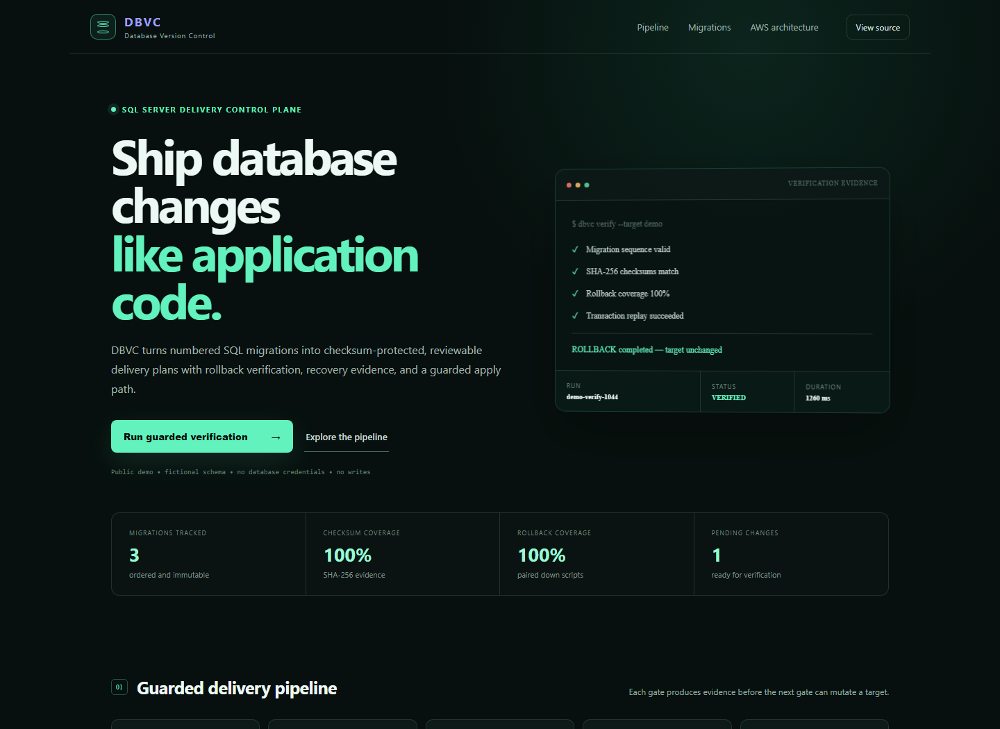
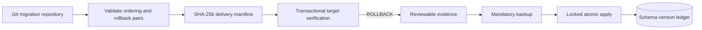

# DBVC — Database Version Control

[](https://github.com/MontassarBenMesmia/dbvc-platform/actions/workflows/ci.yml)
[](https://nodejs.org/)
[](https://angular.dev/)
[](https://www.microsoft.com/sql-server)
[](docs/aws-architecture.md)
[](LICENSE)

DBVC is a guarded SQL Server migration control plane. It validates numbered migrations, produces SHA-256 evidence manifests, verifies pending changes inside a rolled-back transaction, requires a recoverable backup before apply, and records exactly what was delivered.



## Why it exists

Application code has branches, reviews, checksums, CI, and rollback plans. Database changes often arrive as disconnected scripts. DBVC brings the same delivery discipline to SQL Server without accepting arbitrary SQL through its web API.

## Safety model



- Forward files follow `NNN_name.up.sql`; every file requires `NNN_name.down.sql`.
- Versions must be unique and contiguous.
- The engine rejects database-switching `USE` directives.
- Verification executes the complete plan and always rolls it back.
- Apply is disabled unless an operator explicitly enables writes and provides a backup path.
- The hosted demo is deterministic and has no database credentials or command-execution endpoint.

## Repository layout

```text
frontend/          Angular dashboard and component tests
backend/           Express API, security headers, and API tests
engine/            PowerShell validation, planning, verification, and apply engine
database/          Fictional SQL Server migrations, rollback files, and seed data
infra/aws/         Terraform reference building blocks
docs/              Architecture and operating guides
```

## Run the public demo locally

```bash
docker compose up --build app
```

Open `http://localhost:8080`.

For frontend development, run `npm start` in `frontend` and `npm start` in `backend`. Angular proxies `/api` to port `8080`.

## Exercise the migration engine

Validation and planning need only PowerShell 7:

```powershell
./engine/Invoke-Dbvc.ps1 -Action Validate
./engine/Invoke-Dbvc.ps1 -Action Plan
```

`Verify` and `Apply` additionally require `sqlcmd` and the environment variables shown in `.env.example`. Apply remains blocked until `DBVC_ALLOW_DATABASE_WRITES=true` and `-BackupPath` is supplied.

## AWS deployment design

The production reference separates a public control plane from a private execution plane: CloudFront/S3 and Cognito at the edge, an ECS API behind an ALB, SQS-driven PowerShell workers, Secrets Manager, DynamoDB locking, encrypted S3 evidence, and RDS for SQL Server in private subnets. See [AWS architecture](docs/aws-architecture.md) and the [Terraform starter](infra/aws/README.md).

## Documentation

- [Architecture and trust boundaries](docs/architecture.md)
- [AWS production architecture](docs/aws-architecture.md)
- [Migration contract](docs/migration-contract.md)
- [Local operation](docs/local-development.md)
- [Security policy](SECURITY.md)

## Provenance

This is an independent, public-safe reconstruction of general database delivery concepts explored during an internship. It contains no employer source code, business rules, identifiers, schemas, data, documentation, credentials, screenshots, or Git history. All implementation and sample data in this repository were created specifically for this portfolio edition.

Developed by [Montassar Ben Mesmia](https://github.com/MontassarBenMesmia).
