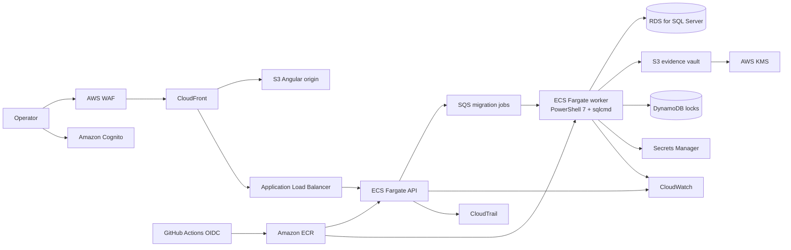

# AWS production reference architecture

This architecture is a deployment design, not a claim that the public demo currently runs the paid production topology.

## Network

- CloudFront, WAF, and the ALB form the public ingress path.
- API tasks run in private application subnets; workers and RDS run in isolated data subnets.
- Workers reach AWS services through VPC endpoints and reach SQL Server only on TCP 1433 through a dedicated security group.
- NAT is optional when all image, log, secret, queue, and artifact traffic uses endpoints.

## Identity and secrets

- Cognito issues user tokens; the API maps groups to read, verify, approve, and apply permissions.
- GitHub Actions assumes a narrowly scoped deployment role through OIDC—no long-lived AWS keys.
- SQL credentials live in Secrets Manager and are fetched only by the worker task role.
- KMS keys separate artifact encryption from log encryption.

## Execution and recovery

1. API validates metadata and writes an immutable plan to the evidence bucket.
2. API creates an idempotent job and sends its identifier to SQS.
3. Worker takes a DynamoDB lock scoped to environment and database.
4. Verify runs in a transaction and rolls back. Apply additionally creates a SQL Server backup.
5. Worker uploads manifests, checksums, logs, and results to versioned S3 storage.
6. CloudWatch alarms on failed jobs, queue age, task failures, and unhealthy targets; CloudTrail records control-plane actions.

## Availability and cost controls

- Multi-AZ RDS and multiple worker tasks are production options, not required for the portfolio demo.
- SQS redrive sends repeatedly failing jobs to a dead-letter queue.
- S3 lifecycle rules move old evidence to Glacier and expire noncurrent demo versions.
- ECS services can scale to zero in non-production environments.
